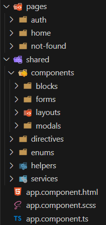

# ▶️ EasyAngular

Welcome to the EasyAngular boilerplate! This project is designed to help you quickly start a new **Angular 18** project with **Bootstrap 5** and various useful libraries. It comes with pre-coded elements to streamline your development process.

## Getting started
### Prerequisites

Make sure you have the following installed :
- [Node.js](https://nodejs.org/) (version 20)
- [Angular CLI](https://angular.dev/) (version 18) using `npm install -g @angular/cli`

### Installation
Clone the repository :
```sh
git clone https://github.com/NicolasRoehm/angular-boilerplate.git
cd angular-boilerplate
npm install
```

### ✒️ Usage
- Rename `EasyAngular` and `easy-angular` with your project name
- Place favicon generated with [RealFavIconGenerator](https://realfavicongenerator.net/) into `src/assets/img/favicon` folder

### Development server

Run the following command for a development server. Navigate to http://localhost:4200/. The app will automatically reload if you change any of the source files.
```sh
ng-serve
```

## Boilerplate content
### 🗂️ Source code structure

<table>
  <tr>
    <td>
      
    </td>
    <td>
      <ul>
        <li><strong>Pages</strong>
          <ul>
            <li>Auth (login, forgot password, validate account) with 2 possible layouts</li>
            <li>Home</li>
            <li>404</li>
          </ul>
        </li>
        <li><strong>Shared components</strong>
          <ul>
            <li>Blocks : toast & progress bar</li>
            <li>Forms : confirm</li>
            <li>Layouts : page & header</li>
            <li>Modals : wrapper</li>
          </ul>
        </li>
        <li><strong>Enums</strong> : endpoints / environments / storage keys</li>
        <li><strong>Helpers</strong> : storage / string</li>
        <li><strong>Services</strong> : app (for requests) / store (for state management using signals)</li>
        <li><strong>i18n</strong> : en.json (for internationalization)</li>
      </ul>
    </td>
  </tr>
</table>

### 🌐 Included packages
- [Bootstrap 5](https://getbootstrap.com/) : SCSS style & [ng-bootstrap](https://ng-bootstrap.github.io/) components
- [Axios](https://github.com/axios/axios) : HTTP client
- [ArrayTyper](https://github.com/FranzStrudel/-caliatys-array-typer) : Utility for type-safe array operations
- [angular-svg-icon](https://github.com/czeckd/angular-svg-icon) : SVG icon support
- [ngx-translate](https://github.com/ngx-translate/core) : Internationalization library

## 🛠️ Tools
- Generate models from JSON - https://app.quicktype.io/
- Generate favicon from SVG - https://realfavicongenerator.net/

## Angular CLI commands
### Code scaffolding
Generate a new component :
```sh
ng generate component component-name
```
You can also use `ng generate` for directives, pipes, services, classes, guards, interfaces, enums, and modules.

### Build
Build the project :
```sh
ng build
```
The build artifacts will be stored in the `dist/` directory.

### Running tests
#### Unit tests
Run unit tests via Karma :
```sh
ng test
```

#### End-to-End tests
Run end-to-end tests via a platform of your choice. You need to add a package that implements end-to-end testing capabilities :
```sh
ng e2e
```

## Further help
To get more help on the Angular CLI, use `ng help` or visit the [Angular CLI Overview and Command Reference](https://angular.dev/tools/cli) page.